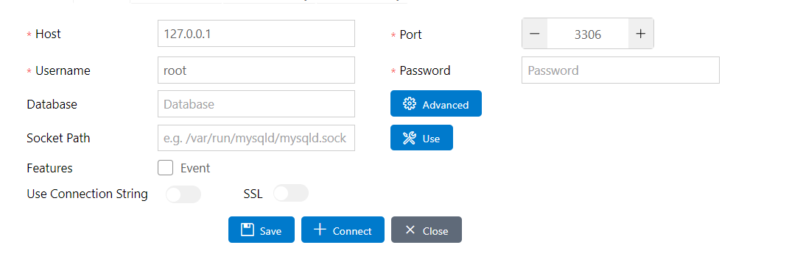

### Acessando o PDO

- Extensões utilizadas

- Para podemos controlar o banco de dados vamos utilizar a extensão do MySQL

- Vamos criar um banco de dados para o nosso projeto

- Como fazer a conexão com o banco de dados
- Acesse a extensão pelo o menu lateral

- Click para criar uma nova conexão
- Ao abrir a nova tela preencha na parte de baixo os dados de conexão (host,port, username e root)

